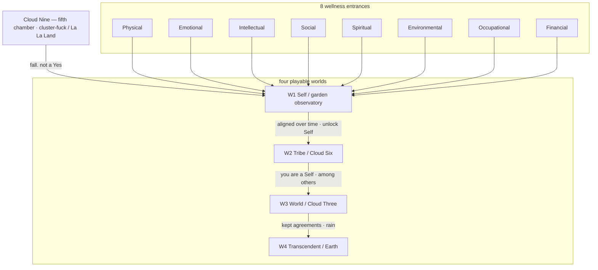

# Descent cosmology — plan only

**Status:** research + architecture. **Do not implement this stack yet.**
**Date:** 16 September 2026 (corrected same day)
**Host that stays live:** Hopf Decision Wells v0.2 (Garden / Forest / Desert / Core).
**Spoken source:** Paul — falling off Cloud Nine into the garden observatory; eight aspects of self on loops; then Tribe, World, Transcendent.
**Owner locks:**
- [God’s Mind Dreaming](https://godsminddreaming.com/) has **five chambers**. The eight are **entrances**, not GMD chambers.
- Playable worlds are the **four** in §0.1. Cloud Nine is the **fifth chamber**: the fall / living torus you come out of (and the earned weather you may return to). It is not a fifth nested shrink-layer in this host.
- Eight entrances = the **8 Dimensions of Wellness** from *CLUSTER FU#K* (Barry Stamos & Paul Cooper). You must **get them aligned and keep them aligned over time** to demonstrate alignment in Self. Source: attached outline, 24 pp.

This document updates the *plan*. It does not change DEC-VP-01, DEC-GATE-01, session-only SAVE, or the four-world host already flying.

The current lock is in [`HOPF_DECISION_WELL_LOCK.md`](./HOPF_DECISION_WELL_LOCK.md). Classification remains `implemented_with_limitations` in [`HANDOFF.md`](./HANDOFF.md).

---

## 0. One sentence

You fall out of the cluster-fuck of La La Land through eight **wellness entrances** into a garden still in the clouds, and there you develop who you want to become by aligning Physical, Emotional, Intellectual, Social, Spiritual, Environmental, Occupational, and Financial — and **keeping** them aligned; as a Self you enter Tribe; as a tribe you enter World, where kept agreements rain; the last world is Earth — love, nature, family, vision, belief, and weather — and none of that is a signature.

---

## 0.1 Lock: four playable worlds, eight wellness entrances, Cloud Nine as the fifth chamber

Owner table. This replaces the earlier W1–W5 weather assignment.

| World | Place / altitude | Work |
|---|---|---|
| **W1 Self / garden observatory** | Still in the clouds. You **fall out of La La Land** to get here. | Develop **who you want to become**. Eight **entrances** (cube vertices) = eight wellness dimensions. Alignment is **demonstrated over time**, not by visiting once. |
| **W2 Tribe / Cloud Six** | Ideas hold shape. | You are a **Self** now, among others. Same abacus, other people. |
| **W3 World / Cloud Three** | Friends, kept agreements, cloud thickens. **Rain hits the ground.** | Art, business, work beyond the inner circle. Making it rain is **this** world — not Earth-as-business. |
| **W4 Transcendent / Earth** | Ground of being. | **Love, nature, family, vision, belief, and weather.** Earth is sacred here, not a marketplace. |

**Fifth GMD chamber (not a W-number in that table):** **Cloud Nine** — the living torus / La La Land you fall from, and the earned sky-weather already coded as Garden presentation (`coreUnlocked ∧ tetraAlignment`). Unearned fall ≠ earned presentation. Do not ship Cloud Nine as `ScaleLayerId = 4`.

The title *CLUSTER FU#K* is the honest name for the unearned Cloud Nine state: eight dimensions unaligned, a mess that is still you. W1 is gathering that mess onto loops. The GMD landing still says “orient to eight interior chambers.” Plan words:

| Count | What it is | What it is not |
|---|---|---|
| **Four** | Playable worlds W1–W4 | Eight wellness dimensions |
| **Five** | GMD chambers = Cloud Nine + W1–W4 | Eight GMD interiors |
| **Eight** | **Entrances** = Cluster Fu#k dimensions, met in W1 | Worlds, GMD chambers, a sixth scale |

HUD and later code: `entrance`, ids `physical` … `financial` (or `E0`–`E7`). Never `gmdChamber`.

Harmonic already in the host:

- **8 cube vertices** = eight wellness entrances (W1).
- **4 tetra vertices** = W1–W4.
- **Cloud Nine** = torus / sky, not a fifth cube vertex.

Gold-ring shrink volume ≠ vertex-entrance. Dual-use cube stays forbidden.

---

## 1. What was said (kept literal, then corrected)

**First speech:** fall off Cloud Nine into a garden observatory still in the clouds; eight aspects on loops; unlock Self; then Tribe; then World as rain; then Transcendent modeled on GMD.

**Corrections that now win:**

1. GMD has **five chambers**. Eight are **entrances**.
2. Playable names and weather are the **owner table in §0.1**.
3. The eight are the **Cluster Fu#k wellness dimensions**. Alignment in Self is **get aligned and keep aligned over time**.

So: Cloud Six is **Tribe**. Cloud Three is **World**, and **rain lives there**. Earth is **Transcendent**. Who-you-want-to-become is **W1 Self**, in the garden, still in cloud, via eight wellness loops.

The Intention Abacus remains the **repeating mechanic inside a world**, not a fifth playable world.

---

## 2. What is already shipped (do not break)

| Piece | Current lock | Keep | Relation to §0.1 |
|---|---|---|---|
| Four nested worlds | Garden → Forest → Desert → Core | Yes | Four playable GMD worlds. Dress names are not yet the social names |
| Vertex map | V0 Self / Cloud Six · Observatory Garden · GENERATE | Garden + Self match **W1**. **Cloud Six moves off V0** onto W2 Tribe | Copy only, later |
| | V1 Forest · Circuit Forest · PRESENCE | Not in the owner table | Passage between W1 and W2, or Tribe’s biome — see §6 |
| | V2 Tribe · Monument Desert · KEEP PROMISE | Social name matches **W2**. Altitude becomes Cloud Six | Dress vs prism is a later skin |
| | V3 World · Inner Core · RELEASE / ACT | Social name matches **W3**. Rain belongs here | W4 Transcendent/Earth is the name that is *not* currently on a vertex |
| Cloud Nine | Presentation in Garden after Core unlocked **and** four active agreements | Earned fifth-chamber weather | Opening fall is the unearned fifth chamber |
| Workshop | Hopf Workshop v0.2 at each vertex | Same protocol at every world | Each wellness entrance is a **seat/fiber**, not a second protocol |
| DEC-GATE-01 | Commit is not a scale key | Rain, shards, weather, walking an entrance still do not shrink you | Keeping eight dimensions aligned is **Workshop time**, not a gate |
| Impossible Cube | Gold ring at Garden plaza | **8 vertices = 8 wellness entrances** | Ring volume stays the shrink gate |
| Seats | Maya / Finn / Bea / Sam (four) | Correct for **W2 Tribe** | Eight wellness beads are **dimensions of one person**, not four people |

---

## 3. Cosmology flip

| | Unearned Cloud Nine (fifth chamber, opening) | Earned Cloud Nine (fifth chamber, presentation) |
|---|---|---|
| When | You fall out of the cluster-fuck into **W1** | After W1–W3 work has been *kept* |
| Feeling | Eight dimensions unaligned, vapor | A sky you and yours thickened |
| Mechanic | Land at a wellness **entrance**. No Yes. | Garden presentation already coded |
| Forbidden | Fall or entrance as consent or scale key | Pretty torus as a signature |

Keep the earned predicate. Later, add the opening descent into W1 with eight unattached wellness loops.

Scale travel = ScaleSystem. Alignment = Workshop. DEC-GATE-01 has no weather exception and no entrance exception.

---

## 4. The repeating abacus (every playable world)

1. Entrances / seats exist before they are gathered. People are not fibers. A **dimension** is not a world. Social-as-dimension is not Tribe-as-world.
2. Learn (Explore). Ready is not Yes.
3. Attach an intention to a loop. A closed loop is holonomy-honest, not a reset.
4. Align beads around a shared *versioned* goal without fusing home hoops.
5. Record reviews. Commit explicitly. Walking all eight statues is not an agreement.
6. **Keep it.** Withdrawal pauses. A new draft does not inherit old Yes. Returning to the same public answer after a loop is holonomy, not a reset.
7. A sealed current-version agreement may unlock the next world’s **gate**.

| World | Who is on a hoop | Lattice (candidate) | Unlock means |
|---|---|---|---|
| **W1 Self / garden** | Eight **wellness dimensions** of one person | Cube 8-vertices; optional stella octangula | Dimensions aligned **and kept** → enter Tribe as a Self |
| **W2 Tribe / Cloud Six** | Other people (4-seat parade) | Tetrahedron: 4 seats, 6 links | Enter World as a tribe member |
| **W3 World / Cloud Three** | Offers that leave the inner circle | Rain = presentation of kept World Act | May look at Earth / Transcendent |
| **W4 Transcendent / Earth** | Love, nature, family, vision, belief, weather | Torus interior / ground of being | Not a login. Not a Yes |

---

## 5. Eight wellness entrances (W1)

Source: *CLUSTER FU#K — 8 Dimensions To Living Wellness*, Stamos & Cooper. Book order is the id order. Cube-corner assignment is later dress, not authority.

| Id | Entrance | Book work (outline) | Loop in the instrument |
|---|---|---|---|
| **E0 Physical** | body | exercise, nutrition, sleep, check-ups | Home fiber of the body. Neglecting it yanks every other bead. |
| **E1 Emotional** | feeling | awareness, self-care, resilience, stress, mindfulness | Phase of how you hold an aim. Not a Yes. |
| **E2 Intellectual** | mind | lifelong learning, creativity, critical thinking, problem-solving | Explore / math lens live here without granting consent. |
| **E3 Social** | relating *as a self* | healthy relationships, communication, community, support | **Not W2.** This is your capacity to relate. Tribe is other people signing. |
| **E4 Spiritual** | purpose / values | meaning, values-alignment, reflection, practice | **Not W4.** This is personal purpose. Earth is love, nature, family, weather. |
| **E5 Environmental** | place | sustainable living, nature, ecological footprint | Your loop with place. W4’s nature is the world of that loop, not this entrance. |
| **E6 Occupational** | craft / work-as-becoming | career, work-life, satisfaction, environment | **Not W3 rain.** Who you want to become *at work*. Making it rain with others is World. |
| **E7 Financial** | material stewardship | literacy, budget, save, invest, debt | Stewardship of means. Not a marketplace world. |

### 5.1 Interconnectedness = field links, not fusion

The book: we are multidimensional; neglecting one dimension impacts the others; balance can look different for each person.

Hopf: eight featured fibers → C(8,2) = **28 pairwise links**. Draw **eight entrance loops** loud. The 28 are the field that makes “neglect Physical and Emotional slips” visible as coupling, not as one fused hoop. Chern ≠ 0: there is no single global wellness scalar.

### 5.2 Keep aligned over time (the actual Self test)

Owner: someone must **get aligned and keep aligned over time** to **demonstrate** alignment in Self.

That is holonomy + versioned consent, not a checklist:

| Book (ch. 10 wellness plan) | Workshop |
|---|---|
| Self-assessment in each dimension | Explore / display z. Ready is not Yes |
| Goal for each dimension | Propose (versioned). Old Yes dies |
| Action planning | Reviews for *this* version |
| Implementation | Commit, then Act if unblocked |
| Evaluation and adjustment | RETURN / new draft. History append-only |
| Setbacks | Withdraw pauses. Repair does not restore consent |

**Demonstrate** means: all eight have a current-version **Yes** (or an explicit, recorded No that the constitution accepts), reviews recorded, no open repair, **and** the agreements have not been withdrawn. A pretty gathering of eight beads is display. Unlocking the Tribe gate is a **ScaleSystem** read of those Workshop facts — DEC-GATE-01 still says the commit command is not itself a shrink key; a separate gate may open *because* the facts hold.

Visiting E0–E7 once is tourism. The cluster-fuck returns if a dimension is neglected; that is the 28-link field doing its job.

### 5.3 Do not collapse scales

| Dimension (W1 entrance) | Later world it is *not* |
|---|---|
| Social | W2 Tribe |
| Occupational / Financial | W3 World (rain, art, business with others) |
| Spiritual / Environmental | W4 Earth (love, nature, family, weather) |

Same person, different charts. A fiber is not a citizen. A dimension is not a chamber of GMD.

### 5.4 Prism shards

Earned only through verified journeys on a dimension: Explore → reviews → current-version Yes → Commit. A shard is presentation of a *kept* dimension, not Ready, not a scale key. Host stays session-only. Do not import “I Am A Real Human.”

### 5.5 Geometry

Impossible Cube, 8 vertices = E0–E7. Stella octangula optional (two tetras = inner/outer becoming). Do not claim the book *is* the Hopf fibration. SAMHSA’s eight-dimension model is a clinical chart; Cluster Fu#k is the local source; Hopf is the workshop kernel. Three languages, one W1.

---

## 6. Forest, Core, and dress vs social name

The owner table has four social worlds. The host has four nested **dresses**: Garden, Forest, Desert, Core.

| Option | Mapping | Cost |
|---|---|---|
| **A. Relabel in place** | Garden=W1 Self, Desert=W2 Tribe (Cloud Six), Core=W3 World (Cloud Three). Forest stays PRESENCE passage. W4 unbuilt or Core interior later. | Least coordinate change. **Cloud Six copy must leave V0.** |
| **B. Four-for-four** | Garden=W1 Self, Forest=W2 Tribe/Cloud Six, Desert=W3 World/Cloud Three, Core=W4 Transcendent/Earth | Fits tetra 1:1 |
| **C. Fold Forest** | Garden holds W1; next shrink is Tribe | Breaks current gate chain |

**Default: B as the *name* lock, A as the *shipped coordinates* until a dress pass.** Do not move wells this turn.

“Unlock south” remains speech-to-text for **Self** unless Paul says otherwise.

---

## 7. Tribe — W2 Cloud Six

Already the parade: four seats, six edges, tetra in the middle.

- You arrive **as a Self** because eight dimensions have been *kept*.
- Cloud Six is this world’s altitude, not Self’s.
- Do not replace Maya / Finn / Bea / Sam with E0–E7.
- Social **entrance** (E3) is still yours; Tribe seats are other people.

---

## 8. World as rain — W3 Cloud Three

Art, business, making it rain = **W3**. Occupational/Financial **entrances** are how a Self *becomes* someone who can do that; the rain is a kept World Act with others.

Rain does not shrink you into W4.

---

## 9. Transcendent / Earth — W4

Love, nature, family, vision, belief, **and weather**. Earth is not the marketplace.

Spiritual and Environmental **entrances** are personal loops. W4 is the world those loops were pointing at.

If option B: Core *is* W4 (layer 3). If option A: W4 is a new lock. Do not add `ScaleLayerId = 4` until that pick. Do not reuse earned Cloud Nine as W4.

Art: W1 garden stays a light observatory in cloud. W4 may go Hyperspace Cathedral without dragging Garden into twilight.

---

## 10. Math that must stay honest

Normative Hopf: `src/workshop/hopf.ts` / hopf-workshop `hopf_model.py`.

- Fiber = loop = one wellness dimension’s intention-space.
- Bead = intention in that dimension. Gauge = reframe. New base point = new aim.
- Alignment = phase coherence **kept through time**, not fusion of the eight into one hoop.
- Linking C(8,2)=28 is the book’s “interconnectedness” made visible and quiet.
- Holonomy π(1−cos θ): **keeping** aligned is the Self test. RETURN is not a reset.
- Chern |c₁| = 1: no single wellness score that signs for you.
- Display z ≠ protocol z until Explore.
- Geometry is not permission. A dimension is not a world. Rain is not Act. A shard is not Yes. A fractal is not belief.

WillVector cosine-0.8 remains an embedding analogy, not π.

---

## 11. Phased implementation (stopped)

| Phase | What | Depends on |
|---|---|---|
| **0** | Current Decision Wells (live) | done |
| **1** | Opening fall from Cloud Nine into W1 garden | Paul: yes |
| **2** | Eight **named** wellness entrances on the cube. Who you want to become. Keep-aligned-over-time is the unlock, not tourism | This lock (names are now known) |
| **3** | Relabel Cloud Six onto Tribe; Cloud Three onto World. Forest A/B/C | Paul §6 |
| **4** | Tribe unchanged mechanically | DEC-GATE-01 |
| **5** | World rain on valid Act | W3 agreement active |
| **6** | W4 Transcendent/Earth dress | Option A vs B |

**Hard stop:** do not implement phases 1–6 in this turn.

---

## 12. Decisions for Paul

1. Confirm eight entrance names = Cluster Fu#k list in book order (this turn — treated as yes).
2. Cloud Nine dual weather as the **fifth chamber**? Recommended: yes.
3. Entrance lattice: cube vertices, star-tetra, or both (ring stays the shrink gate)?
4. Forest/Core dress: **A** / **B** / **C**?
5. “South” = Self, or compass?
6. How long is “over time” for Self unlock in a *session-only* teaching host — a full protocol round on all eight, or a later SAVE_VERSION 2?
7. DEC-GATE-01: rain, weather, shards, fractals, **entrances** never travel scale by themselves. Recommended: confirm.
8. Host: stay this teaching instrument, or later `jedisherpa/fractal-block` Babylon 8?

---

## 13. Research notes

- Cluster Fu#k follows the familiar SAMHSA eight-dimension chart. Local source is Stamos & Cooper. Do not cite SAMHSA as the in-game author.
- GMD public landing still says eight interior chambers; owner lock is five chambers + eight **wellness entrances**.
- `metacanon-sphere` 9 pages ≠ 8 dimensions ≠ 5 chambers.
- Weather numbers 9 / 6 / 3 are altitude labels. Do not recode `ScaleLayerId` to 8, 9, 6, or 3.
- 8-direction torus breathing is optional art for eight loops around a garden axis. Not consent.

---

## 14. Copy seeds (not applied now)

> You are falling off Cloud Nine. The garden observatory is still in the clouds. This is Self. The gold ring is a gate, not a well. Eight **entrances** wait at the cube’s corners: Physical, Emotional, Intellectual, Social, Spiritual, Environmental, Occupational, Financial. They are not worlds. Here you develop who you want to become — and you have to keep it.

> Visiting is not aligning. Aligning once is not keeping. Keeping is how you demonstrate a Self.

> Tribe is Cloud Six: ideas hold shape because you arrived as a Self. World is Cloud Three: kept agreements thicken until it rains. Earth is Transcendent: love, nature, family, vision, belief, and weather.

> Hoops align intentions. Clustering is a picture, not permission. Rain waters the world. It does not sign your name.
