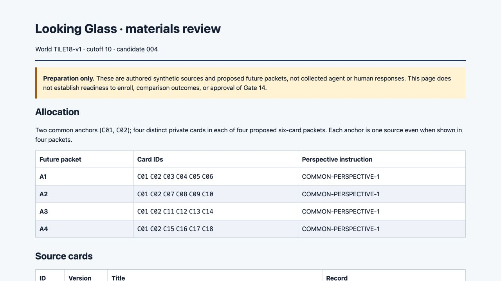

# Materials recovery correction — candidate 004

**The independent audit gives this packaging recovery correction a bounded pass.** Canonical, directory-symlink and file-symlink entry paths now execute real builds and verification; all three fresh outputs match the delivered 72-file candidate exactly. A child process's exit 0 or success-like text cannot substitute for an actual verified artifact. The result applies to the recorded macOS/Node v24.17.0 checks, not unrestricted platform compatibility.

Human materials approval remains pending. This correction does not advance dependent preparation, authorize either deferred study or complete the overall preparation goal. No research snapshots, exchange messages, transfer responses or human participants were collected. Gate 14 remains unapproved. The [authority](../authority.json) and [scope](../scope-and-acceptance.md) preserve that boundary.

## What changed, and what stayed fixed

The [candidate 004 manifest](../package-candidate-004/MANIFEST.json) has SHA-256 `66c2343ea244d5e8946b7a6841520c9af5d7361c74b358c018d8733f01bdd823`. Its 71 entries plus the root manifest comprise 72 files.

The CLI entry helper resolves filesystem identity instead of comparing unnormalized path strings. Previously, `/var/...` and Node's canonical `/private/var/...` caused candidate 003's entry guard to skip work silently. The new supervising command checks child status, success markers, actual inventory and saved bytes/hashes before reporting success. Importing the module remains distinct from directly executing its CLI.

The [independent audit](../audit/INDEPENDENT_AUDIT.md) confirms **all 58 baseline pins match candidate 003 exactly**, including design, key, tasks, allocations, schemas, settings, participant bundles and transfer resources. The full comparison has seven changed paths, two added tooling paths and no removals. The preview changes only its literal candidate identity. Prior frozen evidence remains intact: 1,947 historical entries and 352 materials entries passed verification. The earlier 292-value key agreement is carried forward on unchanged inputs; it is not a new research outcome.

## Acceptance evidence and limits

| Expected | Independently observed | Interpretation / limit |
| --- | --- | --- |
| Real work through equivalent paths | Three fresh builds/verifications from only packaged tooling/design; canonical, directory-symlink and file-symlink outputs match every byte and manifest | Original silent no-op case corrected for the tested path forms |
| Import without CLI effects | Real and directory-symlink imports continue, with only the importer sentinel and unchanged staged inventory | No build, CLI output, evidence write or host-process exit; exported functions remain callable |
| Errors fail rather than overwrite or silently succeed | Invalid mode, absent input, missing/corrupt output and overwrite attempts exit 1; overwrite leaves every original hash intact | Missing-output diagnostic is a raw Node ENOENT stack; malformed JSON reports a parse error |
| Status/text alone cannot pass | Exit 0 with no artifacts, forged success text with no artifact, and forged text with corrupted output are rejected | Actual inventory and byte verification are essential |
| Existing behavior and materials stay fixed | Five packaged regression tests plus the authored-freeze design check pass; 58 baseline pins unchanged | Packaging correction only; substantive scoring remains separate unfinished work |
| Preview remains read-only and truthful | Ten HTTP checks: two exact HTML routes and eight denials; identity-only page change | Full-union researcher overview, not participant isolation |

The [independent CLI evidence](../evidence/audit/independent-cli-1789942481320.json) retains absolute commands, runtime, outputs, statuses, inventories and digests. Its [first attempt](../evidence/audit/independent-cli-1789942461819.json) is also preserved: an audit assertion expected “MANIFEST” where the correctly failing CLI emitted ENOENT for the missing directory. The auditor corrected only that expectation and reran successfully, without changing packaged code. Separately, the [builder's retained attempt summary](../evidence/builder/cli-regression-summary-004.json) includes a similarly over-narrow diagnostic assertion followed by passing attempts. These are test-harness failures, not deleted evidence or falsely passed product behavior. The original materials-v1 failures remain unchanged.

## Actual browser check

The [host acquisition](../evidence/browser-candidate-004/ACQUISITION.md), independently checked, contains four observations and three successful intended transitions: keyboard-open C04, mouse-close C04 and reload with disclosures collapsed. All **72 DOM-serialized source instances** (18 × 4) match the unchanged world; **only C04 was visually opened**. The viewport was 1280×720 at DPR 2, without observed horizontal overflow; console capture was empty. Reload retained scroll position 529.5, so no return-to-top behavior is claimed.

Both untouched original JPEGs were directly inspected for this synthesis. The overview shows candidate 004 and its preparation-only disclosure. The opened C04 record visibly preserves understanding, rejected endorsement and alternative grants, with remaining JSON below the viewport. DOM comparison is not eighteen visual inspections, and this smoke establishes neither broad accessibility nor human comprehension.

## Recovery and next boundary

[RECOVERY.md](../RECOVERY.md) gives exact clean-rebuild instructions using **only packaged builder-tooling and research-team/design**, in a fresh staging directory. It retains command results and requires success output, the full inventory, the known manifest and exact matching bytes. Historical disposable fixtures contain absolute symlinks whose recorded targets may become stale after relocation; they document the tests and are not portable recovery inputs. The local [preview](http://127.0.0.1:44010/) serves only `/` and `/index.html`.

The correction completes this bounded tooling repair, not the preparation program. Materials review still precedes the dependent equivalent instrument and synthetic runner/transfer/scorer work. Transfer validation, comparator/cost integration, substantive provenance review, instrument acceptance, human protocol/readiness and comparison/mechanism/cross-scale plans, independent dispositions and the final verified preparation ZIP remain required. Actual collection stays deferred; real model/version/context and isolation must be rechecked before any later separately authorized launch.

Actual engineering roles were GPT-6 Astra xhigh for scope/synthesis, GPT-5.6 Sol high for implementation, a separate GPT-5.6 Sol high worker for independent audit, and the host for routing, preservation and supported browser inspection. These are not research participants. Final preservation and repository publication are separate host steps; none is claimed by this packet.
