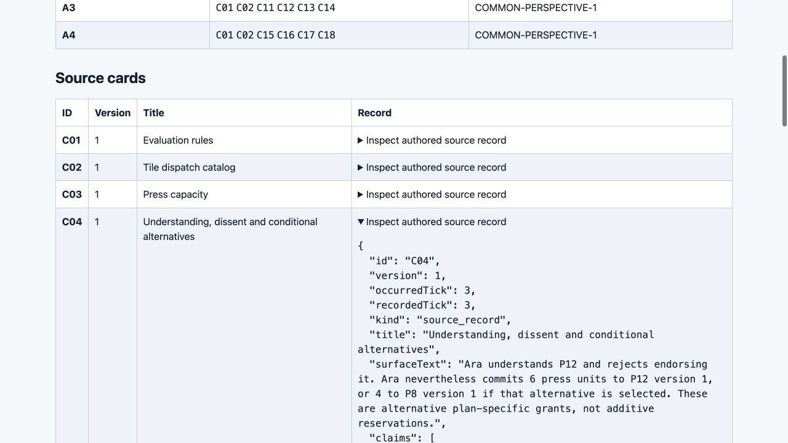
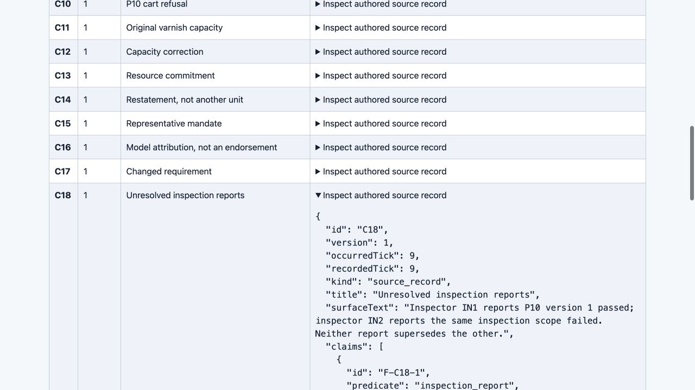

# Materials v1 review — draft pending candidate 002 audit

**The finite answer key is independently checked. Materials software acceptance remains pending.** Candidate 001 preserves valid bundle and researcher-preview evidence, but its snapshot validator accepted consequential invalid records. Candidate 002 is a separate correction under review; this draft makes no acceptance claim for it.

The user's current scope is preparation only: both actual four-agent and human research are deferred. No research snapshots, exchange messages, transfer responses or human observations were collected. Engineering fixtures, blind mathematical derivations and browser inspections are not research participant outputs. Gate 14 remains unapproved. The latest explicit defer-both confirmation governs any residual execution wording in the stored goal; the recorded goal-editor limitation is not a completion blocker or a need to ask again.

## What is prepared and checked

The [design contract](../design/DESIGN_CONTRACT.md) specifies eighteen fictional source cards at tick 10. Two shared anchors plus four distinct cards per packet produce four six-card inputs. Initial prompts use the same perspective instructions and D01–D08; each local answer is scored against its actual six-card evidence scope. D09/D10 belong to the union phase. Separate researcher-only transfer materials contain six tasks in seven contexts. Source/task/schema bytes were frozen before the blind key; the author key was compared only after that independent derivation was frozen.

The independent [cross-review](../audit/materials-cross-audit-001.md) found **194/194 development value atoms and 98/98 transfer value atoms equal**, plus eight matching W06 bundle-ID arrays. The 194 development atoms comprise four initial scopes × 38 plus 42 union atoms. All 442 author evidence references resolve within the relevant supplied scope or public rules. Reference resolution is not an audit of every proof's sufficiency; shorter valid proofs can differ from the author's illustrative traces. The reading boundary was procedural blindness in a shared filesystem, not enforced filesystem isolation.

| Expected distinction | Checked observation | Interpretation | Remaining limitation |
| --- | --- | --- | --- |
| Missing facts differ from false or contradictory evidence | Blind and author values agree across all declared scopes | Initial unknowns are correctly keyed against local inputs | No solver has answered these tasks |
| Understanding, endorsement, commitment and capacity remain separate | The union supports P12: output 12, cost 7, demand 10, exact press/cart grants; Ara's rejection remains | Rejection need not prevent a separately stipulated commitment | Fictional records do not establish human assent or understanding |
| Changed requirements and dependencies matter | P8 fails demand 10; P10 retains corrected varnish shortage, Bea's refusal and conflicting inspection reports | A plan's readiness does not replace its component distinctions | No physical dispatch or recovery was observed |
| Wording alone does not determine relation | C06/C13 share “Ready.” but differ in predicate/argument roles; C13/C14 restate one commitment | Surface and relation contrasts are explicit and checkable | No general theory of word meaning or measured analogy learning |
| Transfer preserves version, demand and conflict boundaries | W01 supported; W02/W03 unknown; W04 refuted; W05 conflicted; W06 distinguishes shared from separate capacity | All finite expected answers reconcile | Withheld cases have not been administered |
| Participant inputs exclude peer, union, key and withheld content | Candidate 001's four bundles and 69 files match manifests; 14 HTTP probes pass | Packaging and read-only preview boundaries were checked | Disk separation does not isolate a future same-workspace solver |
| Invalid snapshot/action records must fail validation | Candidate 001 accepted documented violations | **Candidate 001 blocked for materials acceptance** | Candidate 002 requires independent exact-candidate verification |

## Preserved failure and browser evidence

Candidate 001 and its evidence are now preserved by the [109-entry freeze](../evidence/CANDIDATE_001_FREEZE.json), SHA-256 `2ad6291b79695def48079c66fa63fb79e16f199f9a4e5a241af2aed09eb0edb2`. The [candidate 001 closure](../audit/candidate-001-audit-closure.md) retains the validator failures: union phase with only A1's six cards and initial tasks, A4 identity over A1's packet, duplicate interpretation IDs, unsupported proposed action status, and positive-plus-negative evidence mislabeled as supported or refuted. A cited but false numeric answer also demonstrates why shape/reference checks cannot be called source correctness. The initial key-comparison harness itself produced false errors when it treated W06's evidence array as an atom map; its original failure and corrected pass both remain, without changing frozen keys or design inputs.

The host's [actual browser acquisition](../evidence/browser-candidate-001/ACQUISITION.md) contains 16 observations, seven completed actions and four original JPEGs. The independent browser check matched 288 rendered source-record instances, verified the disclosure/reload transitions and found an empty console. Only a 1280×720 desktop viewport was observed. This is a read-only researcher overview exposing the full union, not the integrated plain/visual instrument or a blind participant interface.

The two original images below were inspected directly for this synthesis. They show the opened source disclosures, not whole-record proof or participant comprehension. Other portions of the JSON extend below the viewport; exact record comparison comes from the retained DOM evidence.

## Proposed later procedure, not launch approval

The [execution proposal](../design/execution-plan.json) fixes a bounded initial/comparison/exchange/revision/synthesis/transfer sequence. Proposed same-model research calls use GPT-5.6 Sol at high effort, with exact model version, actual supported settings and context size to be resolved before any separately authorized launch. Tools/network must be disabled in fresh serialized-input contexts or a verified restricted runner. A preflight failure prevents launch; sources must never be silently truncated.

The proposal has 17 unique calls and a maximum 55,296 generated tokens before retries. Attributable totals including one transfer call are POOL 20,480, UNION 8,192 and INTERACTIVE 43,008; POOL and INTERACTIVE share the exact initial four calls, charged once in actual total cost. Access and compute differ. In particular, the interactive branch receives the union at exchange. Accuracy changes cannot identify interaction benefit apart from additional evidence and computation. The proposed twelve quartets use three explicit rotations, four replicates each, without full per-agent balance over four blocks. No calls or costs were incurred for this research proposal.

The [plain/visual mapping](SOURCE_EQUIVALENT_MAPPING.md) translates the frozen contract into inspectable information and operations. It is a preparation specification, not delivered visual functionality or evidence of visual advantage.

## Open preparation work and ownership

The current software blocker is candidate 001's validator; the implementation worker owns candidate 002 and a separate Sol auditor must determine its disposition. This packet must be finalized against that audit, including its exact package and evidence hashes.

Three design/use limits must stay explicit. First, resolved citations do not certify all substantive provenance proofs; independent scoring review remains necessary. Second, the transfer response format is specified in a prompt but has no dedicated machine-readable response schema in this packet; a future transfer collector/scorer needs an explicit validator and negative tests before use. Third, exchange/revision/synthesis lineage, actual context budgets and isolated execution have proposals but no research-run preflight evidence. These are future-use dependencies, not permission to collect data now. No source/task value ambiguity remained in the independent derivation.

Broader preparation remains incomplete: the integrated equivalent instrument and its acceptance corpus, human protocol/readiness and comparison/mechanism/cross-scale plans, documentation identifying responsible owners, setting and unresolved decisions, and the updated verified preparation ZIP. Future execution approvals may remain pending when preparation is complete; the package must identify what is missing and what it gates. It must not invent consent, enrollment readiness or institutional approval. Actual four-agent collection and all human studies are deferred and do not block the preparation-only goal.

Actual engineering roles are GPT-6 Astra xhigh for specification/synthesis, GPT-5.6 Sol high for implementation, a separate GPT-5.6 Sol high worker for blind derivation/audit, and the host for routing, preservation and supported browser inspection. These roles describe engineering work only. The recorded provenance file predates completion of the blind review; the completed audit artifacts supply its later status.

**Draft disposition:** answer-key reconciliation passes within the finite stipulated model; candidate 001 software acceptance fails; candidate 002 and final packet acceptance are pending. No freeze, final publication, study launch or goal completion is claimed here.
