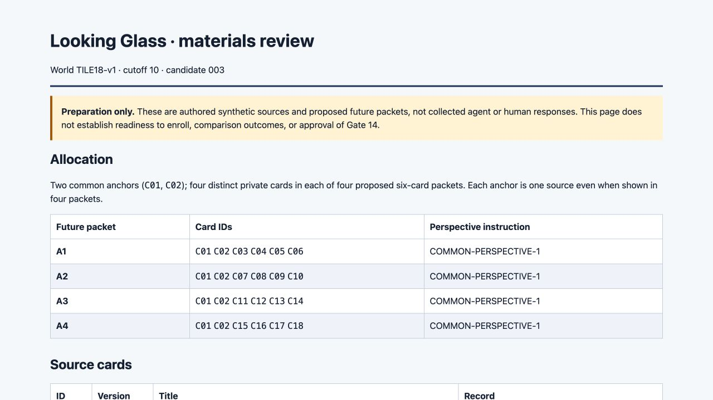
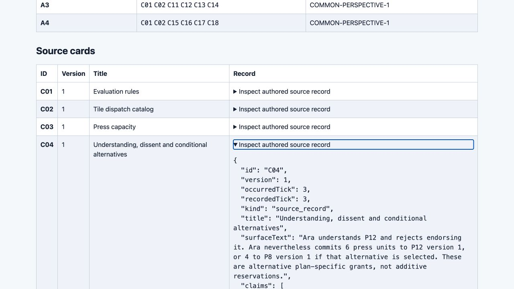

# Materials v1: independently checked preparation component

**Candidate 003 passes the bounded authored-materials stage. Human materials approval is pending, and the overall preparation goal remains incomplete.** The [independent audit](../audit/candidate-003-core-audit.md) accepts the authored inputs, finite key reconciliation, participant packaging and specified structural/source-witness guards. It does not accept a complete scorer, research runner, integrated plain/visual instrument or human-ready study.

The user explicitly deferred both four-agent and human research. There are **zero collected research snapshots, exchange messages, transfer responses or human participants**. Engineering fixtures, mathematical derivations and browser checks are separate evidence. Gate 14 remains unapproved. The latest confirmed preparation-only scope governs residual execution wording in the stored goal.

## Accepted materials and exact scope

The [design](../design/DESIGN_CONTRACT.md) contains eighteen fictional cards at cutoff tick 10: two shared anchors plus four distinct cards in each of four six-card packets. All four initial prompts use the same perspective instruction and D01–D08. Initial answers are keyed against their own evidence scope, with missing facts left unknown. Union tasks include D09/D10. Six withheld tasks span seven contexts and remain outside initial participant bundles; the author key is researcher-only.

Source/task/schema bytes were frozen before the independent derivation. That derivation was frozen before author-key comparison. **194/194 development and 98/98 transfer value atoms agree**, with eight matching W06 bundle-ID arrays. The development count is four local scopes × 38 plus 42 union atoms. All 442 author references resolve within the supplied scope or public rules. This establishes finite values and reference reachability; substantive sufficiency of every proof remains required preparation work. The blind reading boundary was procedural in a shared filesystem, not enforced filesystem isolation.

Candidate 003 contains **70 files, including 69 root-manifest entries**. Its [manifest](../package-candidate-003/MANIFEST.json) SHA-256 is `7f7ba05a8f5d5fca9298d4e0b81210f049ff3a804fc94ab420d89fa4c5f32ced`. Each participant bundle contains exactly its assigned six cards and eight initial tasks, without peer claims, key paths or withheld-task paths. The researcher preview exposes the full union and is never a blind participant condition. The closed [334-file core manifest](../CORE_MANIFEST.json) has SHA-256 `16795483e387a34c0f32e7185723d221dcc772da333a3e3a90848e2a9b80e4d6`; it excludes this synthesis and final handoff review.

| Expected | Observed | Interpretation | Unresolved boundary |
| --- | --- | --- | --- |
| Distinguish understanding, endorsement, grants and capacity | Union selects P12: output 12, cost 7, demand 10, sufficient exact grants/capacities; Ara's rejection remains | The authored rejection and commitment can coexist | No human assent, understanding or physical dispatch measured |
| Preserve changed requirements and contrary evidence | P8 fails demand 10; P10 retains varnish shortage, cart refusal and conflicted inspection | Component distinctions survive the readiness conclusion | No observed coordination or recovery outcome |
| Separate surface from directed relation | C06/C13 share wording but differ in relation; C13/C14 restate one commitment | No duplicate capacity or wording-based merger in the key | No universal meaning or analogy-learning claim |
| Transfer boundaries change answers | W01 supported; W02/W03 unknown; W04 refuted; W05 conflicted; W06 separates shared from independent capacity | All 98 transfer values independently reconcile | Tasks have not been administered |
| Reject invalid records within the declared guard | 17/17 prior/adjacent outcomes, 5/5 phase outcomes and 16/16 literal-source cases match | Candidate 003 corrects the preserved validator defects | Guard validation is not complete numerical/provenance scoring |
| Preserve package and preview access boundaries | All package bytes match; 14/14 route probes pass | Saved bundles and read-only HTTP allowlist are checked | Future runner isolation needs its own verification |
| Make source inspection work visibly | Three intended transitions succeed in candidate 003 | Bounded preview smoke passes | Earlier candidate 002 intent mismatches remain unexplained |

## Candidate history and validator limits

**001 — blocked.** The validator accepted wrong phase/card/task scope, an agent identity inconsistent with the packet, duplicate interpretation IDs, unsupported action status and incorrect four-valued evidence labels. Its [109 frozen entries](../evidence/CANDIDATE_001_FREEZE.json) remain unchanged.

**002 — blocked.** It repaired those guards but accepted four literal interpretation types with only public rule R07 as evidence. A rule cannot attest understanding, endorsement, a resource grant or a model attribution. Its [119 frozen entries](../evidence/CANDIDATE_002_FREEZE.json) remain unchanged. Seven browser calls completed, but only five achieved their intended state: the first C04 click left it collapsed, then an action labeled “close” opened it. Later controls recovered; the cause and the concurrent viewport change were not established.

**003 — bounded pass.** Each asserted polarity for those literal interpretations now requires a supplied claim matching predicate, directed roles, value and evidence kind. Rules may supplement that witness. Wrong roles, quantity, source kind and model-artifact relabeling fail the tested guards. An exact literal commitment record is distinct from R05's derived “grant covers requested quantity” judgment. A wrong but well-formed task number can still pass structural validation and must fail separate scoring. Neither the guard nor reference reachability proves every derived answer.

The initial cross-review harness also had an array-iteration error that produced false reference failures. Its failed output and corrected pass are retained; source and key bytes did not change.

## Actual browser evidence

The [candidate 003 acquisition](../evidence/browser-candidate-003/ACQUISITION.md) contains eight observations, three completed actions with intended outcomes, and two untouched original JPEGs. Independent comparison matched **144 DOM-serialized source instances**: all eighteen records in each observation. This does not mean all eighteen disclosures were visually opened. Keyboard Enter opened C04, mouse click closed it, and reload restored collapsed disclosures. The observed viewport was 1280×720, without horizontal overflow; captured console entries were zero.

Both originals were inspected directly for this synthesis. The overview visibly identifies candidate 003 and its preparation-only scope. C04's opened disclosure shows the authored understanding, rejection and alternative commitments; the full JSON extends below the image. The HTML differs from 002 only in the candidate label. This short smoke does not erase 002's misses or establish comprehensive accessibility, responsiveness or human comprehension.

The inspected read-only preview is [localhost:44009](http://127.0.0.1:44009/). Its HTML hash is `24e7cfbcadea10f87e758e4bb98429a4d892917cca331aa80507033d78bcc8d2`. The [packaged tooling instructions](../package-candidate-003/builder-tooling/README.md) describe exact-byte reproduction in a clean staging directory; copied scripts are evidence and must not be invoked from inside the candidate directory.

## Clean reproduction and CLI limitation

A supplemental [clean reproduction](../evidence/clean-reproduction-003-canonical.json), using only the packaged builder-tooling and research-team/design directories, regenerated all 70 files byte-for-byte with the same manifest hash. The unchanged code succeeded when invoked through canonical absolute paths. The [first attempt](../evidence/clean-reproduction-003.json) through macOS `/var/...` instead of Node's canonical `/private/var/...` returned exit 0 with empty output and created no package: the CLI entry guard compared unequal path strings and never ran. Both attempts remain preserved outside the unchanged 334-file core.

Follow [RECOVERY.md](../RECOVERY.md), requiring the explicit success output, complete output inventory and exact manifest hash; **exit 0 alone is insufficient**. Harden the entry guard in the next tooling-preparation revision and retain a symlink-path regression check. This recovery establishes the recorded canonical-path case, not unrestricted cross-platform CLI readiness.

## Proposed procedure and remaining preparation

The frozen [execution proposal](../design/execution-plan.json) specifies POOL, UNION and INTERACTIVE, with 17 unique calls and a 55,296 generated-token cap before retries. Attributable caps including transfer are 20,480, 8,192 and 43,008; POOL and INTERACTIVE share the same initial four calls. Access and computation differ, and INTERACTIVE gains full sources at exchange. Neither this proposal nor future unadjusted contrasts establish interaction benefit. Twelve proposed quartets use three rotations repeated four times, without full per-agent balance. These parameters are proposed, not executed or ratified launch settings.

The next boundary is **human review of these materials before dependent preparation proceeds**. Required work before overall preparation completion includes:

- A transfer-response schema/validator with negative tests; executable pooling, comparator, scorer and cost/attempt accounting; substantive provenance-proof review; and a synthetic end-to-end runner preserving invalid records and lineage.
- The [source-equivalent plain/visual mapping](SOURCE_EQUIVALENT_MAPPING.md) implemented and accepted using labeled synthetic imports, actual browser workflows and the broader source/permission/version acceptance corpus.
- Human protocol/readiness and comparison/mechanism/cross-scale plans, clear owner/setting responsibilities and pending decisions, independent dispositions, and the updated verified preparation ZIP.

These software and documentation requirements are **not deferred away with data collection**. Actual model/version/settings, tokenizer/context fit and tool/network isolation must also be reverified at any later separately authorized launch. Future consent, setting or institutional approvals may remain honestly pending in a completed preparation package; none is invented here. Actual research collection remains deferred.

Engineering roles were GPT-6 Astra xhigh for specification/synthesis; GPT-5.6 Sol high for implementation; a separate GPT-5.6 Sol high worker for blind derivation/audit; and the host for routing, preservation and supported browser inspection. These workers are not four research participants. This packet claims the independent core verdict only; final handoff review, preservation and repository publication are separate host steps.
